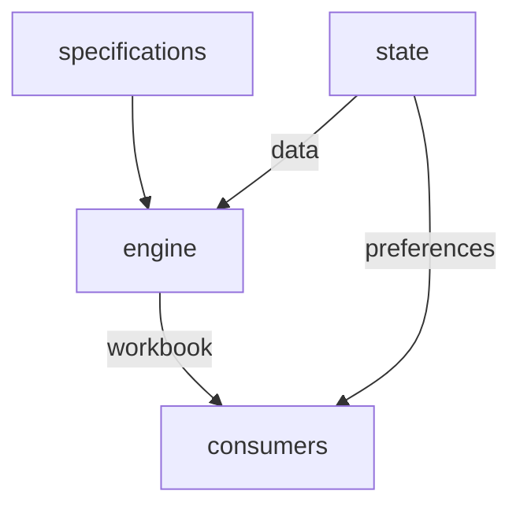

# Implementation plan

This implementation plan describes how we will build Thumbtax, a web app that estimates one's U.S. individual tax return.

## User stories

Thumbtax aims to support a limited set of relatively simple income and tax situations.
The following user stories illustrate what features the app provides, but they are not exhaustive.

### Income estimation

- As a **taxpayer with hourly wages,** I want to estimate how much income my employer will report on Form W-2 for this year, so that I can predict my tax liability.
- As a **taxpayer with an annual salary,** I want to estimate how much income my employer will report on Form W-2 for this year, so that I can predict my tax liability.
- As a **taxpayer who receives one-time bonuses,** I want to estimate how much income my employer will report on Form W-2 for this year, so that I can predict my tax liability.
- As a **taxpayer who receives supplemental income,** I want to specify the withholding rate for different portions of income, so that I can accurately predict my withholding amount.
- As a **taxpayer who worked for multiple employers this year,** I want to estimate how much income each employer will report on Form W-2, so that I can predict my tax liability.
- As a **taxpayer with income from investment dividends,** I want to estimate how much income each payer will report on Form 1099-DIV, so that I can predict my tax liability.
- As a **taxpayer with income from investment interest,** I want to estimate how much income each payer will report on Form 1099-INT, so that I can predict my tax liability.
- As a **taxpayer with capital gains,** I want to estimate how much income each payer or brokerage will report on the applicable Form 1099, so that I can predict my tax liability.

### Tax estimation

- As a **taxpayer,** given that I have entered my income and withholding estimates, I want to automatically calculate my estimated total tax and refund or amount owed, so that I can predict how much tax I will owe or how much refund I can expect when I file my actual tax return.
- As a **taxpayer who might need to pay estimated taxes,** given that I have entered my income and withholding estimates, I want to know whether I would incur an estimated tax penalty, so that I can take action now to avoid the penalty.
- As a **taxpayer,** given that I have entered my income and withholding estimates and the IRS would allow me to choose whether to file certain forms or schedules that could affect my total tax, I want to choose whether to include those forms or schedules in the prediction, so that I can understand the effect they will have on my tax return.

### Education and research

- As a **taxpayer,** I want to know that Thumbtax is not offering financial or tax advice, is not affiliated with the U.S. government or any tax filing service, might provide incorrect information, and is not responsible for any errors in my actual tax return, so that I do not mistakenly use it as anything other than an educational tool.
- As a **taxpayer who is unfamiliar with the U.S. federal income tax system,** I want to read brief explanations of important terms and concepts, so that I have a high-level understanding of how my tax liability and total tax are calculated.
- As a **taxpayer who is not familiar with all of the different IRS forms,** I want to read a brief description of each form, schedule, and worksheet, so that I know its purpose and whether I should file it.
- As a **taxpayer who wants to learn even more,** I want to navigate to the relevant page on the IRS website that explains a particular form or concept, so that I can gain a deeper understanding of U.S. tax law or verify the Thumbtax outputs.

### Other

- As a **taxpayer who likes to visualize data,** given that I have at least one tax form present, I want to see a diagram of the tax forms and how they reference each other, so that I can understand their connections visually.
- As a **taxpayer,** I want to save the values I have entered for each tax form, so that I can resume later or come back with new information.
- As a **taxpayer,** I want to export my estimated tax forms in a structured, portable format, so that I can import them into a spreadsheet or similar program to process them further.

## User experience

Overall, the Thumbtax interface is clean and minimal.
It communicates that Thumbtax is an efficient, unbloated tool.
It follows modern conventions in information architecture; uses colors, decorations, and animations sparingly; and is fully responsive and accessible to keyboards and screen readers.

### Navigation bar

Thumbtax has a navigation header bar with links to the different pages.
On narrow screens, the navigation bar converts to a drawer.

### Primary view

Thumbtax has a single main page with two main sections, Income and Taxes, and various controls at the top of the page.

#### Income section

In the Income section, the user estimates their income for the year.
The section contains a list of income-related tax forms, which is populated with an empty Form W-2 by default if there is no saved state.
The user can add and remove these forms as needed.

#### Taxes section

In the Taxes section, the user estimates their taxes for the year based on their inputs in the Income section.
Similar to the Income section, this contains a list of tax forms related to computing one's tax return, which is populated with an empty Form 1040 by default if there is no saved state.

#### Control bar

Important controls are accessible in a control bar at the top of the main page.
The control bar sits below the navigation bar when the latter is present.
However, the control bar is present even on narrow screens; its controls move into an overflow menu if necessary.

- Tax year (currently static since the app only supports the current tax year, but still important to show)
- Filing status selector
- Undo and redo buttons
- Add form button
  - Opens a form selector
- Browser save toggle
- Download button
- Upload button
- Export button
  - Opens a menu with options

### Connections view

Thumbtax also offers an interactive visualization of the connections between tax forms in a graph view.
The graph view is displayed to the left of the primary view described above.
However, on narrow screens, the graph view is moved into another page titled Connections.

In this graph view, each form that the user has added is represented by a small image of its first page.
Forms that exist in the specification but have not yet been added by the user are also shown by default, in a faded or visually distinct style, to aid discoverability.
The user can toggle the visibility of these unadded forms.
References between forms (such as "enter the value from Form 1040, line 7a") are represented by lines connecting the forms.
These connections are derived from the `form_reference` and `form_presence` value provider types in the form specifications.
The overall view is stylized to appear like the tax forms are pinned to a bulletin board and connected by strings (alluding to "thumbtacks," like the name of the app).

The user can pan and zoom the view, move forms around, and click on a form to navigate to it in the Income or Taxes section.

Discussion of the technical implementation of this view is deferred.
Possible approaches include an SVG element, the Canvas API, or a dedicated graph library such as React Flow or Cytoscape.js.

### About page

The About page contains a description of Thumbtax's features, the app's terms of service and privacy policy (both of which are pretty minimal as it's a very simple app), and some author information.

### Form list

Both the Income and Taxes sections contain a list of tax forms.

Here we distinguish a "class" of tax form, such as Form W-2, from "instances" of a class, such as different instances of Form W-2 for different employers.
Some classes are restricted to a single instance; for example, one does not need to file multiple different instances of Form 1040.

The form list displays a table for each form class that the user has added.
Within each table, the first columns show the line number (such as "1" or "2a") and line description.
Then we show a column (or set of columns, if the form itself has multiple columns on this line) for each instance of that form class.
For forms that allow more than one instance, the user can label each instance with a custom string, such as the employer name for each Form W-2.

A form often has multiple sections and different columns in different parts of the form.
These are still rendered as a contiguous table as much as possible.

Only form boxes that require user input render as input fields.
When the user enters a value in such a box, then all boxes that depend on that value automatically recompute their own values.

#### Adding forms

A button in the control bar lets the user add a new form instance by choosing the form class.

If a form class has reached its maximum number of instances, then the option is disabled.
If a form class is present but has not reached its maximum number of instances, then a button within the form view also lets the user add another instance of that class.

For some forms, a taxpayer is required to file them under certain conditions.
If the rules for a box specify that a particular form needs to be present but that form is not present yet, then the box displays a warning state and prompts the user to add the form.

#### Removing forms

Each form instance has a button to remove it.
If removing an instance leaves no remaining instances of that class, the class is also removed from the list.

#### Reordering forms

Each form instance has left and right buttons to reorder it relative to other instances of the same class.
Each form class has up and down buttons to reorder it relative to other form classes in the overall list.

### Saving and exporting

The user's progress is automatically saved in the browser's local storage, so it persists if they accidentally reload the page or want to come back later.
However, they can disable this feature for security.

Alternatively, the user can download a save file which represents the application's current state.
They can then load the save file later from their file system to restore that state.

Finally, the user can export their tax form data as a CSV or Excel file.

The persisted state includes a `taxYear` field indicating the tax year the data pertains to.
If the user loads a save file whose `taxYear` does not match the current build's tax year, a warning is displayed.

When loading a save file or restoring from local storage, unrecognized fields are ignored and missing values are treated as zero.
A warning is also shown in these cases.

### Miscellaneous

- **Keyboard navigation:**
  The tab key focuses successive input elements as usual.
  When an input box is currently focused, the enter key switches focus to the next input box.
  The enter key focus priority is: (1) next column of same line in same form instance; (2) first column of next line in same form instance; (3) first column of first line in next form instance.
- **Value updates:**
  When the user types in a value, we only "commit" the new value and recompute dependent values once the user leaves the input box (the onBlur event).

## System design

Thumbtax is a single-page web application built with Vite and React.
It is frontend-only for simplicity, but could be extended into a full-stack application in the future.

See `system-design.md` for the full document.

### Principles

These principles, listed in no particular order, guide the system design.

- **Separation of concerns:**
  Different parts of the system are not tightly coupled to each other.
  Instead, they define clean interfaces and abstractions which allow us to change the internal implementation of one component, or even move some parts to a backend server, without needing to update any other code.
- **Extensibility:**
  Application data follow a robust, flexible schema that supports future updates.
  For example, each new tax year will likely bring adjustments to various tax forms.
  We can make these adjustments without breaking the schema or code, within reason.
- **Single source of truth:**
  The user's input values and some additional metadata, such as the filing status and instance labels, are the only real state in the overall app, at least conceptually.
  Everything else is derived from these data.
  - Some UI components might maintain temporary local state.
    For example, a form box input only commits its value to the app state on blur.
- **Unit testing:**
  Each unit of code is easy to test with little or no mocking.

### Overview

The system has four major parts:

1. **Form specifications:**
   The set of static specifications describing each supported tax form.
2. **User state:**
   The user's input data and preferences.
   The rest of the application state is derived from this information.
3. **Workbook engine:**
   Essentially a pipeline that takes the specifications and user state as input and produces a _workbook_ as output.
   The workbook contains every form box's value in a structured format.
4. **UI and other consumers:**
   The UI components, data exporters, and other modules that consume the workbook.

### Specifications

Each form specification is defined in a YAML file according to a concise, human-readable schema.

The schema itself is versioned, separately from the tax year.

A code generation script parses and validates the specifications, then writes them to static constants.
These constants have more explicit types than the YAML schema to simplify downstream code.
To speed up the build, we run the code generation manually and check in the constants with Git.

A centralized provider grants access to the form specifications, so as to encapsulate the "retrieval" process.

### User state

### Workbook engine

### UI structure

### Other consumers
