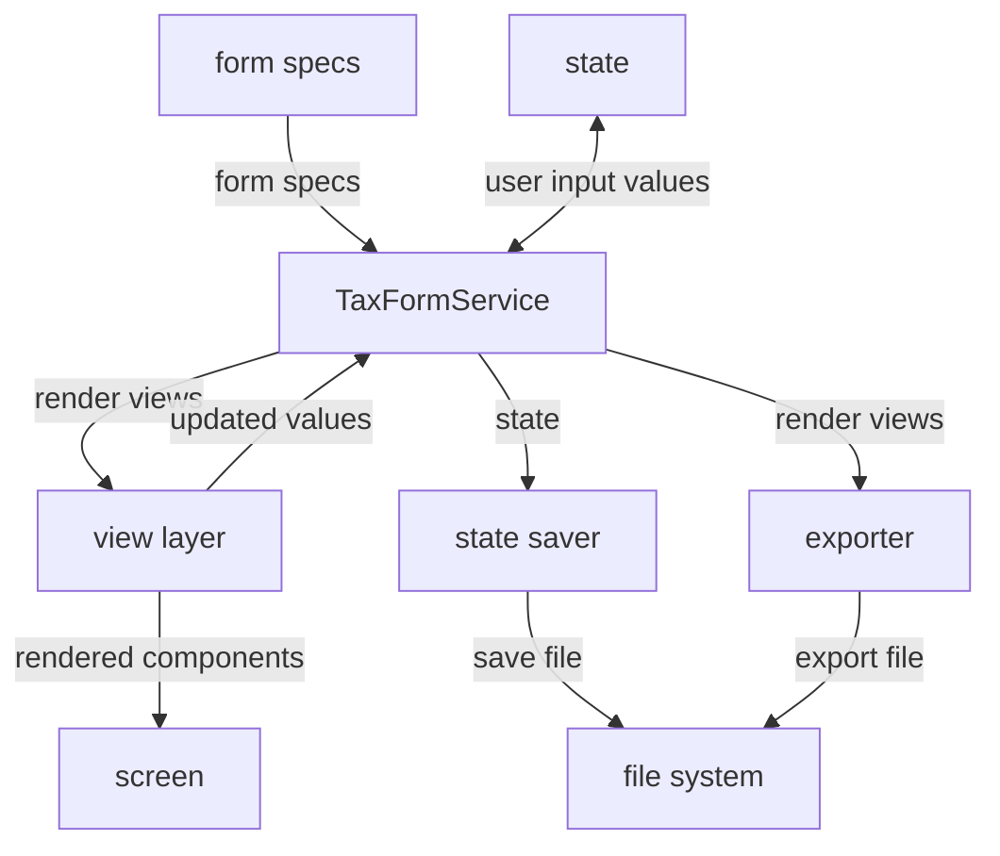
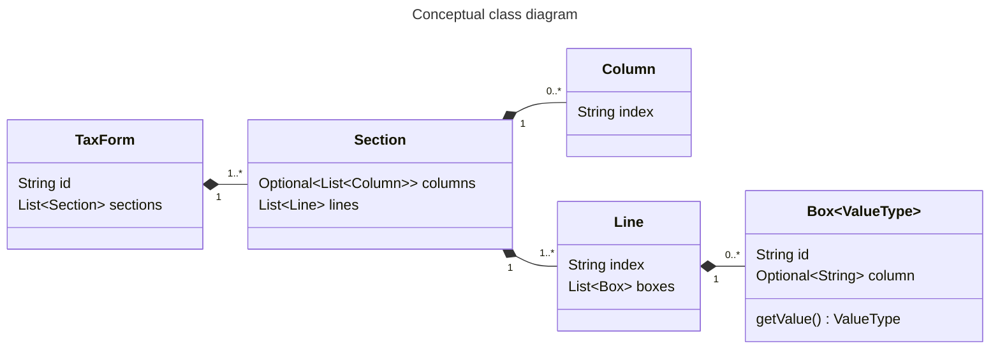
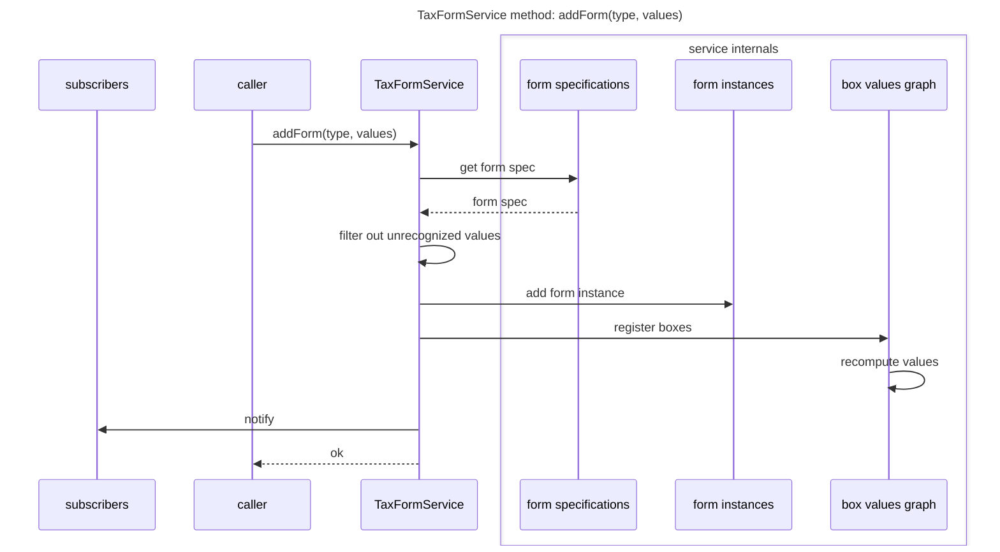
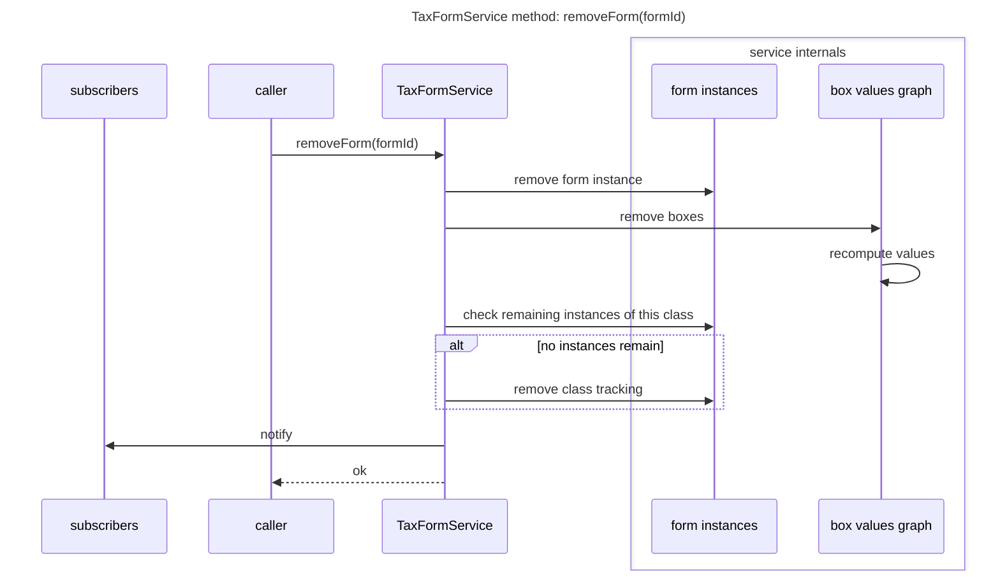
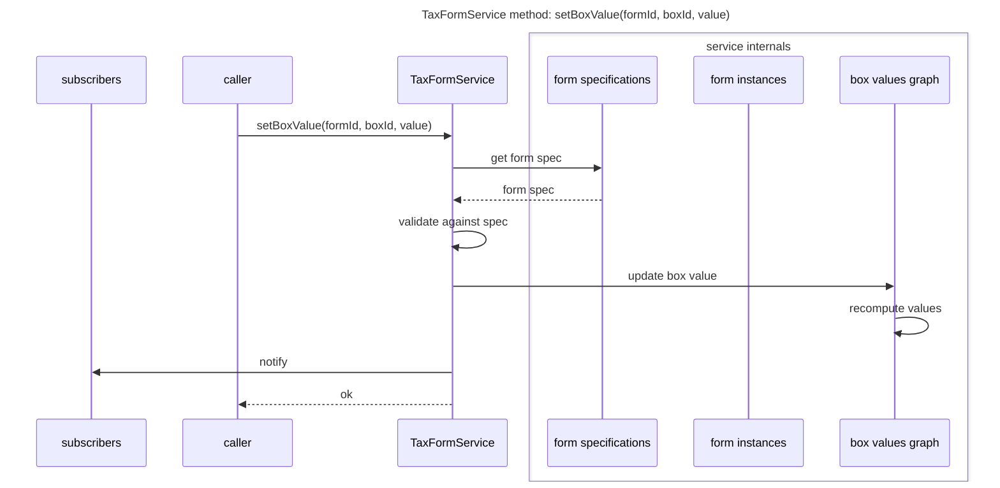
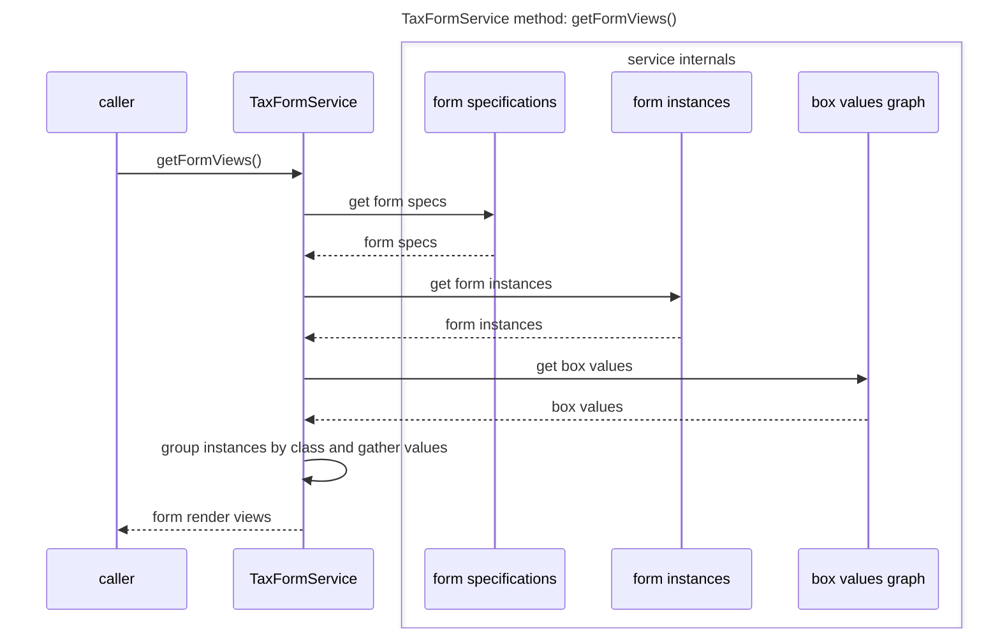
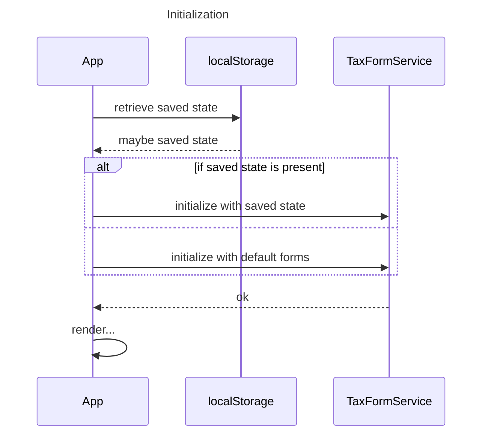
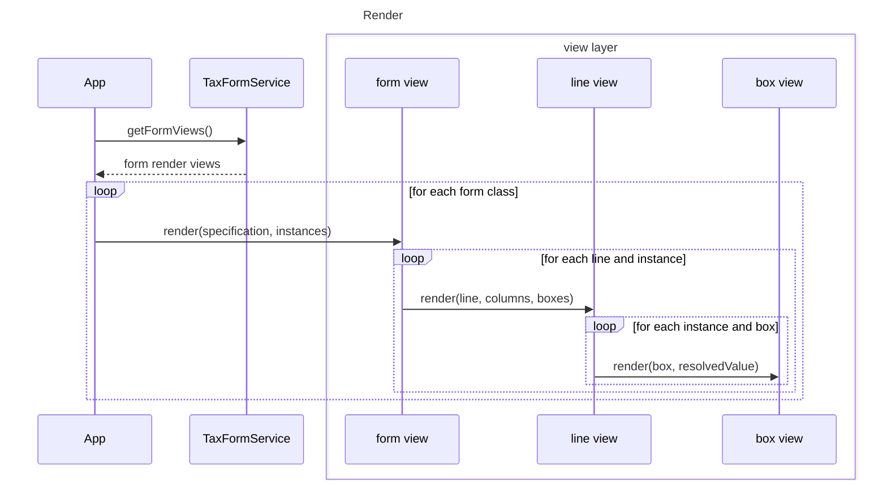
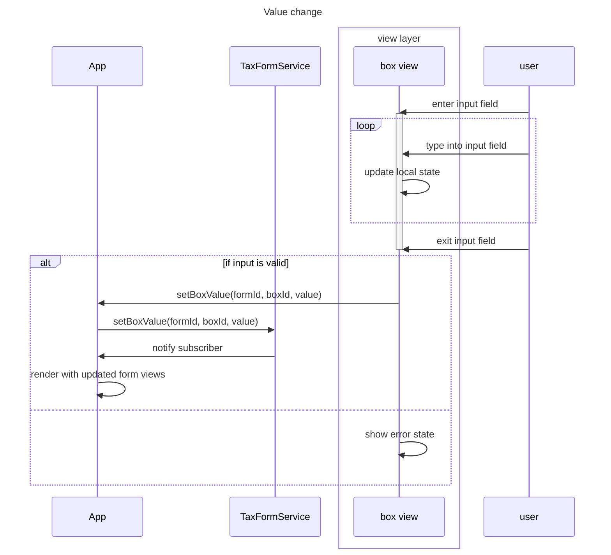

# Implementation plan

This implementation plan describes how we will build Thumbtax, a web app that estimates one's U.S. individual tax return.

## User stories

Thumbtax aims to support a limited set of relatively simple income and tax situations.
The following user stories illustrate what features the app provides, but they are not exhaustive.

### Income estimation

- As a **taxpayer with hourly wages,** I want to estimate how much income my employer will report on Form W-2 for this year, so that I can predict my tax liability.
- As a **taxpayer with an annual salary,** I want to estimate how much income my employer will report on Form W-2 for this year, so that I can predict my tax liability.
- As a **taxpayer who receives one-time bonuses,** I want to estimate how much income my employer will report on Form W-2 for this year, so that I can predict my tax liability.
- As a **taxpayer who receives supplemental income,** I want to specify the withholding rate for different portions of income, so that I can accurately predict my withholding amount.
- As a **taxpayer who worked for multiple employers this year,** I want to estimate how much income each employer will report on Form W-2, so that I can predict my tax liability.
- As a **taxpayer with income from investment dividends,** I want to estimate how much income each payer will report on Form 1099-DIV, so that I can predict my tax liability.
- As a **taxpayer with income from investment interest,** I want to estimate how much income each payer will report on Form 1099-INT, so that I can predict my tax liability.
- As a **taxpayer with capital gains,** I want to estimate how much income each payer or brokerage will report on the applicable Form 1099, so that I can predict my tax liability.

### Tax estimation

- As a **taxpayer,** given that I have entered my income and withholding estimates, I want to automatically calculate my estimated total tax and refund or amount owed, so that I can predict how much tax I will owe or how much refund I can expect when I file my actual tax return.
- As a **taxpayer who might need to pay estimated taxes,** given that I have entered my income and withholding estimates, I want to know whether I would incur an estimated tax penalty, so that I can take action now to avoid the penalty.
- As a **taxpayer,** given that I have entered my income and withholding estimates and the IRS would allow me to choose whether to file certain forms or schedules that could affect my total tax, I want to choose whether to include those forms or schedules in the prediction, so that I can understand the effect they will have on my tax return.

### Education and research

- As a **taxpayer,** I want to know that Thumbtax is not offering financial or tax advice, is not affiliated with the U.S. government or any tax filing service, might provide incorrect information, and is not responsible for any errors in my actual tax return, so that I do not mistakenly use it as anything other than an educational tool.
- As a **taxpayer who is unfamiliar with the U.S. federal income tax system,** I want to read brief explanations of important terms and concepts, so that I have a high-level understanding of how my tax liability and total tax are calculated.
- As a **taxpayer who is not familiar with all of the different IRS forms,** I want to read a brief description of each form, schedule, and worksheet, so that I know its purpose and whether I should file it.
- As a **taxpayer who wants to learn even more,** I want to navigate to the relevant page on the IRS website that explains a particular form or concept, so that I can gain a deeper understanding of U.S. tax law or verify the Thumbtax outputs.

### Other

- As a **taxpayer who likes to visualize data,** given that I have at least one tax form present, I want to see a diagram of the tax forms and how they reference each other, so that I can understand their connections visually.
- As a **taxpayer,** I want to save the values I have entered for each tax form, so that I can resume later or come back with new information.
- As a **taxpayer,** I want to export my estimated tax forms in a structured, portable format, so that I can import them into a spreadsheet or similar program to process them further.

## User experience

Overall, the Thumbtax interface is clean and minimal.
It communicates that Thumbtax is an efficient, unbloated tool.
It follows modern conventions in information architecture; uses colors, decorations, and animations sparingly; and is fully responsive and accessible to keyboards and screen readers.

### Primary view

Thumbtax has three tabs in its primary view: Income, Taxes, and About.
The tabs are displayed in a navigation bar at the top of the page along with other controls, including a filing status selector.
On narrow screens, the navigation controls are collapsed.

#### Income tab

In the Income tab, the user estimates their income for the year.
The tab contains a list of income-related tax forms, which is populated with an empty Form W-2 by default if there is no saved state.
The user can add and remove these forms as needed.

#### Taxes tab

In the Taxes tab, the user estimates their taxes for the year based on their inputs in the Income tab.
Similar to the Income tab, this contains a list of tax forms related to computing one's tax return, which is populated with an empty Form 1040 by default if there is no saved state.

#### About tab

The About tab contains a description of Thumbtax's features, the app's terms of service and privacy policy (both of which are pretty minimal as it's a very simple app), and some author information.

### Form connections

Thumbtax also offers an interactive visualization of the connections between tax forms in a graph view.
The graph view is displayed to the left of the primary view, where the tabs described above are located.
However, on narrow screens, the graph view is moved into a fourth tab titled Connections.

In this graph view, each form that the user has added is represented by a small image of its first page.
Forms that exist in the specification but have not yet been added by the user are also shown by default, in a faded or visually distinct style, to aid discoverability.
The user can toggle the visibility of these unadded forms.
References between forms (such as "enter the value from Form 1040, line 7a") are represented by lines connecting the forms.
These connections are derived from the `form_reference` and `form_presence` value provider types in the form specifications.
The overall view is stylized to appear like the tax forms are pinned to a bulletin board and connected by strings (alluding to "thumbtacks," like the name of the app).

The user can pan and zoom the view, move forms around, and click on a form to navigate to it in the Income or Taxes tab.

Discussion of the technical implementation of this view is deferred.
Possible approaches include an SVG element, the Canvas API, or a dedicated graph library such as React Flow or Cytoscape.js.

### Form list

Both the Income and Taxes tabs contain a list of tax forms.

Here we distinguish a "class" of tax form, such as Form W-2, from "instances" of a class, such as different instances of Form W-2 for different employers.
Some classes are restricted to a single instance; for example, one does not need to file multiple different instances of Form 1040.

The form list displays a table for each form class that the user has added.
Within each table, the first columns show the line number (such as "1" or "2a") and line description.
Then we show a column (or set of columns, if the form itself has multiple columns on this line) for each instance of that form class.

A form often has multiple sections and different columns in different parts of the form.
These are still rendered as a contiguous table as much as possible.

Only form boxes that require user input render as input fields.
When the user enters a value in such a box, then all boxes that depend on that value automatically recompute their own values.

#### Adding forms

A dropdown at the top and bottom of the form list lets the user add a new form class.
For form classes with `cardinality: "one"`, the option is disabled in the dropdown when an instance already exists.
For form classes with `cardinality: "multiple"`, a button within the form view also lets the user add another instance of that class.

#### Removing forms

Each form instance has a button to remove it.
If removing an instance leaves no remaining instances of that class, the class is also removed from the list.

#### Reordering forms

Each form instance has left and right buttons to reorder it relative to other instances of the same class.
Each form class has up and down buttons to reorder it relative to other form classes in the overall list.

### Saving and exporting

The user's progress is automatically saved in the browser's local storage, so it persists if they accidentally reload the page or want to come back later.
However, they can disable this feature for security.

Alternatively, the user can download a save file which represents the application's current state.
They can then load the save file later from their file system to restore that state.

Finally, the user can export their tax form data as a CSV or Excel file.

The persisted state includes a `taxYear` field indicating the tax year the data pertains to.
If the user loads a save file whose `taxYear` does not match the current build's tax year, a warning is displayed.

When loading a save file or restoring from local storage, unrecognized fields are ignored and missing values are treated as zero.
A warning is also shown in these cases.

## System design

Thumbtax is a frontend-only web app built with Vite, React, and TypeScript and served via GitHub Pages.
The specifications for the different available tax forms are statically defined as part of the app bundle.
User-entered information can be persisted locally or the user can export it, but there is no remote storage mechanism.

By omitting a backend, we simplify the app and eliminate most security and privacy concerns.
However, the code is still structured such that data, business logic, and presentation are decoupled.

### High-level architecture



### Data model

The IRS publishes various tax forms, schedules, and worksheets involved in the process of filing tax returns.
Conceptually, these are different names for the same thing in different contexts, so we model them all as "tax forms."



We store a static specification of each type of tax form, represented by the following schema (TypeScript syntax).

```ts
type FilingStatus =
  | "single"
  | "married_filing_jointly"
  | "married_filing_separately"
  | "head_of_household"
  | "qualifying_surviving_spouse";

type TaxFormClass =
  | "f1040"
  | "f1040s1"
  | "f1040sA"
  | "f1040wQDCGT"
  | "f1099DIV"
  | "f8959"
  | "fW2"
  | ...;

type TaxFormBoxIdentifier = string;

type TaxFormSpecification = {
  class: TaxFormClass;
  title: string;
  description: string;
  irsPageUrl: string;
  cardinality: "one" | "multiple";
  sections: Array<TaxFormSection>;
};

type TaxFormSection = {
  heading?: string;
  columns?: Array<{
    index: string;
    description?: string;
  }>;
  lines: Array<TaxFormLine>;
};

type TaxFormLine = {
  index: string;
  description: string;
  boxes: Array<TaxFormBox>;
};

type TaxFormBox = {
  identifier: TaxFormBoxIdentifier;
  columnIndex?: string;
  value: ValueProvider;
  format?: "checkbox" | "financial" | "percentage" | "plain";
};

type ValueProvider =
  | number
  | TaxFormBoxIdentifier
  | { type: "unused" }
  | { type: "number_input" }
  // User enters a list of individual amounts and labels; their total is the box value
  | { type: "list_amounts_input" }
  | { type: "checkbox_input" }
  | {
      type: "form_reference";
      form: TaxFormClass;
      box: TaxFormBoxIdentifier;
    }
  | { type: "sum"; values: Array<ValueProvider> }
  | {
      type: "sum_range";
      form?: TaxFormClass;
      fromLine: string;
      toLine: string;
      column?: string;
    }
  | { type: "difference"; minuend: ValueProvider; subtrahend: ValueProvider }
  | { type: "product"; values: Array<ValueProvider> }
  | { type: "quotient"; dividend: ValueProvider; divisor: ValueProvider }
  | { type: "minimum"; values: Array<ValueProvider> }
  | { type: "maximum"; values: Array<ValueProvider> }
  | { type: "absolute_value"; value: ValueProvider }
  | { type: "numerical_negation"; value: ValueProvider }
  | { type: "form_presence"; form: TaxFormClass }
  | {
      type: "conditional";
      condition: ValueProvider;
      trueValue: ValueProvider;
      falseValue: ValueProvider;
    }
  | {
      type: "comparison";
      value: ValueProvider;
      minimum?: ValueProvider;
      maximum?: ValueProvider;
      strict?: boolean;
    }
  | { type: "logical_negation"; value: ValueProvider }
  | {
      type: "filing_status_map";
      values: Record<FilingStatus, ValueProvider>;
      default?: ValueProvider;
    };
```

We can construct the entire application state from the user's filing status, the set of tax form instances that the user has added, and the values they have entered.
So, that's the only information we need to persist between sessions (in the browser's local storage or a save file).

```ts
type PersistedState = {
  taxYear: number;
  filingStatus: FilingStatus;
  forms: Array<{
    class: TaxFormClass;
    id: string;
    userLabel?: string;
    userValues: Record<TaxFormBoxIdentifier, number>;
  }>;
};
```

As shown above, we model the application around a TaxFormService which performs tax form operations.
One such operation is to produce a render view, an interface suitable for the view layer to display, for each tax form.

```ts
type TaxFormView = {
  specification: TaxFormSpecification;
  instances: Array<{
    id: string;
    userLabel?: string;
    boxValues: Record<TaxFormBoxIdentifier, number>;
  }>;
};
```

### Sequence diagrams

The TaxFormService maintains an internal dependency graph of box values derived from the `ValueProvider` types in the form specifications.
When any user input changes, the service recomputes the dependent values, then notifies subscribers.
Thus, the service encapsulates all computation logic.

The following diagrams explain some different TaxFormService operations.
They describe the expected behavior but do not prescribe any particular implementation.









The following diagrams explain how the app handles some different events.







## Tasks
