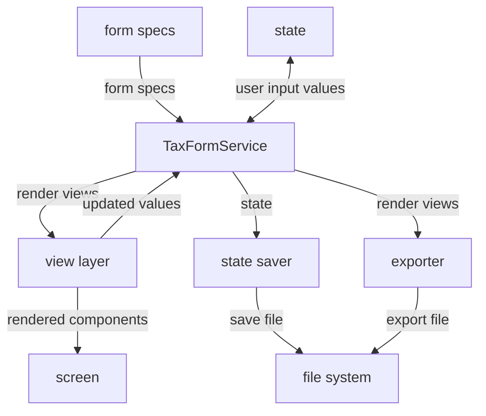

# Implementation plan

This implementation plan describes how we will build Thumbtax, a web app that estimates one's U.S. individual tax return.

## User stories

Thumbtax aims to support a limited set of relatively simple income and tax situations.
The following user stories illustrate what features the app provides, but they are not exhaustive.

### Income estimation

- As a **taxpayer with hourly wages,** I want to estimate how much income my employer will report on Form W-2 for this year, so that I can predict my tax liability.
- As a **taxpayer with an annual salary,** I want to estimate how much income my employer will report on Form W-2 for this year, so that I can predict my tax liability.
- As a **taxpayer who receives one-time bonuses,** I want to estimate how much income my employer will report on Form W-2 for this year, so that I can predict my tax liability.
- As a **taxpayer who receives supplemental income,** I want to specify the withholding rate for different portions of income, so that I can accurately predict my withholding amount.
- As a **taxpayer who worked for multiple employers this year,** I want to estimate how much income each employer will report on Form W-2, so that I can predict my tax liability.
- As a **taxpayer with income from investment dividends,** I want to estimate how much income each payer will report on Form 1099-DIV, so that I can predict my tax liability.
- As a **taxpayer with income from investment interest,** I want to estimate how much income each payer will report on Form 1099-INT, so that I can predict my tax liability.
- As a **taxpayer with capital gains,** I want to estimate how much income each payer or brokerage will report on the applicable Form 1099, so that I can predict my tax liability.

### Tax estimation

- As a **taxpayer,** given that I have entered my income and withholding estimates, I want to automatically calculate my estimated total tax and refund or amount owed, so that I can predict how much tax I will owe or how much refund I can expect when I file my actual tax return.
- As a **taxpayer who might need to pay estimated taxes,** given that I have entered my income and withholding estimates, I want to know whether I would incur an estimated tax penalty, so that I can take action now to avoid the penalty.
- As a **taxpayer,** given that I have entered my income and withholding estimates and the IRS would allow me to choose whether to file certain forms or schedules that could affect my total tax, I want to choose whether to include those forms or schedules in the prediction, so that I can understand the effect they will have on my tax return.

### Education and research

- As a **taxpayer,** I want to know that Thumbtax is not offering financial or tax advice, is not affiliated with the U.S. government or any tax filing service, might provide incorrect information, and is not responsible for any errors in my actual tax return, so that I do not mistakenly use it as anything other than an educational tool.
- As a **taxpayer who is unfamiliar with the U.S. federal income tax system,** I want to read brief explanations of important terms and concepts, so that I have a high-level understanding of how my tax liability and total tax are calculated.
- As a **taxpayer who is not familiar with all of the different IRS forms,** I want to read a brief description of each form, schedule, and worksheet, so that I know its purpose and whether I should file it.
- As a **taxpayer who wants to learn even more,** I want to navigate to the relevant page on the IRS website that explains a particular form or concept, so that I can gain a deeper understanding of U.S. tax law or verify the Thumbtax outputs.

### Other

- As a **taxpayer who likes to visualize data,** given that I have at least one tax form present, I want to see a diagram of the tax forms and how they reference each other, so that I can understand their connections visually.
- As a **taxpayer,** I want to save the values I have entered for each tax form, so that I can resume later or come back with new information.
- As a **taxpayer,** I want to export my estimated tax forms in a structured, portable format, so that I can import them into a spreadsheet or similar program to process them further.

## System design

Thumbtax is a frontend-only web app built with Vite, React, and TypeScript and served via GitHub Pages.
The specifications for the different available tax forms are statically defined as part of the app bundle.
User-entered information can be persisted locally or the user can export it, but there is no remote storage mechanism.

By omitting a backend, we simplify the app and eliminate most security and privacy concerns.
However, the code is still structured such that data, business logic, and presentation are decoupled.

### High-level architecture

### Data model

### Data flow

## Tasks
