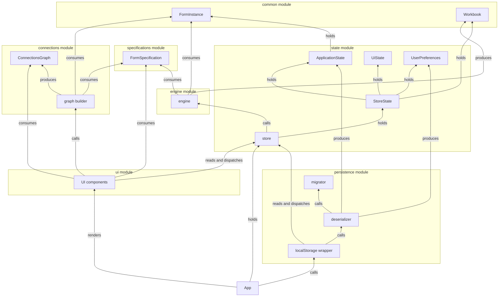

# Modules

## Entity relationships

```mermaid
graph BT
subgraph common module
FormInstance
Workbook
end
subgraph connections module
ConnectionsGraph
connectionsBuilder["graph builder"]
end
subgraph engine module
engine
end
subgraph persistence module
localStorage["localStorage wrapper"]
deserializer
migrator
end
subgraph specifications module
FormSpecification
end
subgraph state module
ApplicationState
UiState
UserPreferences
StoreState
store
end
subgraph ui module
ui["UI components"]
end
App

ui -- reads and dispatches --> store
ui -- consumes --> FormSpecification
ui -- consumes --> ConnectionsGraph
ui -- calls --> connectionsBuilder

App -- renders --> ui
App -- holds --> store
App -- calls --> localStorage

localStorage -- reads and dispatches --> store

connectionsBuilder -- consumes --> FormSpecification & FormInstance
connectionsBuilder -- produces --> ConnectionsGraph

engine -- consumes --> FormSpecification
engine -- consumes --> FormInstance
engine -- produces --> Workbook

store -- calls --> engine
store -- holds --> StoreState
StoreState -- holds --> ApplicationState & UiState & UserPreferences & Workbook
ApplicationState -- holds --> FormInstance

localStorage -- calls --> deserializer
deserializer -- produces --> ApplicationState & UserPreferences
deserializer -- calls --> migrator

migrator ~~~ store
```
