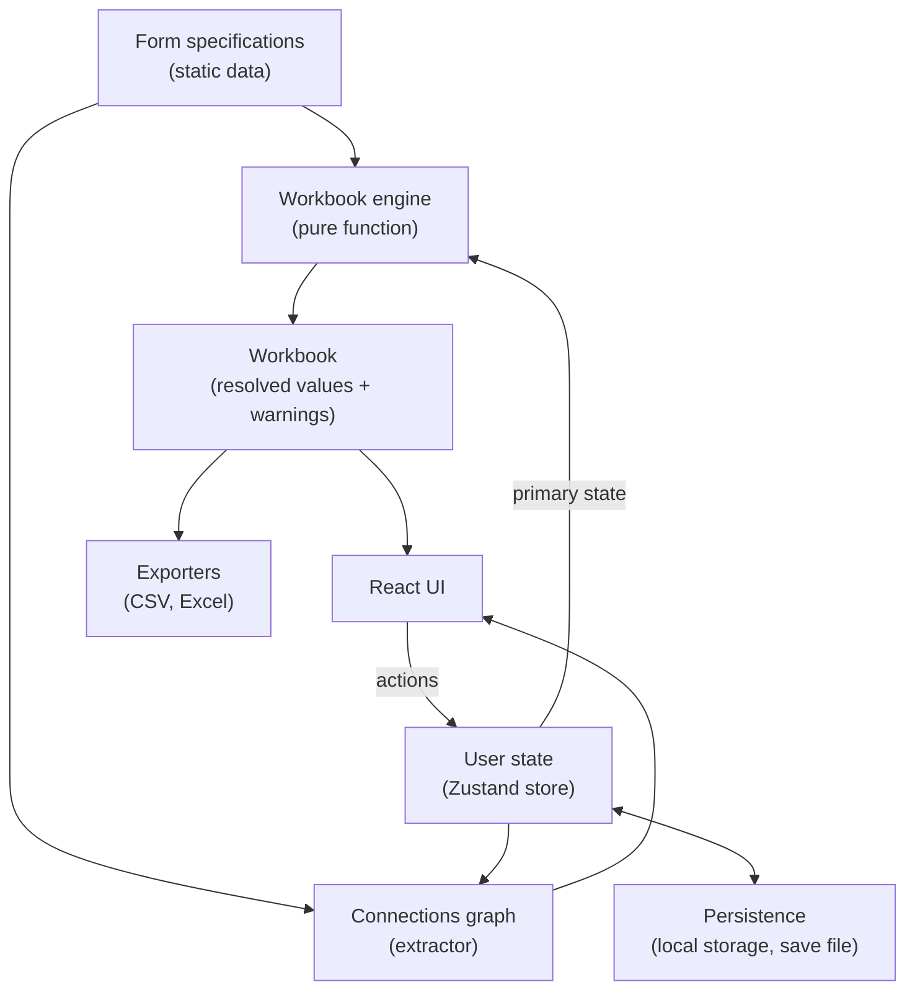

# System design

This document describes the system design for Thumbtax, a frontend-only single-page web application that estimates U.S. individual tax returns.
It assumes the product context established in [index.md](index.md) and only covers what the high-level outline leaves unspecified.

## Overview

The system is organized as four layers, each with a clean boundary:

1. **Form specifications** — static, declarative descriptions of every supported tax form, expressed as pure data.
2. **User state** — the user's filing status, the set of present form instances, and per-box input values, plus user-facing preferences.
3. **Workbook engine** — a pure function that takes specifications and user state and produces the _workbook_, which holds every box's resolved value and any warnings.
4. **Consumers** — UI components, data exporters, the Connections graph extractor, and the persistence layer, all of which read the workbook and (in the UI's case) dispatch actions back into the state layer.



The strict directionality — primary state plus specifications flow into a pure engine, the workbook flows out to consumers, and the UI's only writes go through state actions — is the load-bearing structural decision in the design.
It enables undo/redo, isolated unit testing, and incremental optimization without leaking concerns across module boundaries.

## Principles

These principles guide the design and trade-offs throughout this document. They are listed in no particular order.

- **Separation of concerns.** Each layer defines a small interface with the next; internals can be replaced without touching consumers. The engine, in particular, has no React or DOM dependencies and could be moved to a backend server.
- **Specifications as data, not code.** Every tax form is a static value of `TaxFormSpecification`. Adjusting a form for a new tax year is a data edit; the engine, UI, and persistence code do not change.
- **Single source of truth.** The user's filing status, instance metadata, preferences, and per-box input values are the only authentic state. The workbook, dependency graph, Connections graph data, and all rendered values are derived.
- **Strong, explicit types.** All discriminated unions are fully tagged. The codebase does not use `!` non-null assertions, type casts, or comments that disable the typechecker or linter.
- **Unit-testable units.** Each module exposes a small surface and is testable with little or no mocking. Tests are co-located with source files.
- **Forgiving boundaries, strict internals.** Persistence loads inputs charitably (drop unknowns, default missing, warn rather than throw) so users never lose data due to schema drift; everything beyond the boundary is strictly typed.

## Module organization

Source code lives under `thumbtax-webapp/src/`. The path alias `#src/` resolves to that directory.

The layout follows runtime dependency direction: a module owns the types it produces; only types used across multiple modules live in `common/`.

```
src/
├── main.tsx
├── App.tsx
├── App.test.tsx
├── index.css
│
├── common/
│   └── types/                       # truly cross-module types
│       ├── filingStatus.ts
│       ├── taxFormClass.ts
│       ├── taxFormBoxIdentifier.ts
│       ├── instanceId.ts
│       ├── boxValue.ts
│       └── boxAddress.ts
│
├── specifications/
│   ├── types/
│   │   ├── taxFormSpecification.ts
│   │   ├── taxFormSection.ts
│   │   ├── taxFormLine.ts
│   │   ├── taxFormBox.ts
│   │   ├── boxFormat.ts
│   │   └── valueProvider.ts
│   ├── service.ts                   # getFormSpecification, allFormClasses, allSpecifications
│   ├── service.test.ts
│   ├── validate.ts                  # invariant checker (run in tests + dev startup)
│   ├── validate.test.ts
│   └── forms/
│       ├── form1040.ts
│       ├── formW2.ts
│       └── ...
│
├── engine/
│   ├── types/
│   │   ├── workbook.ts
│   │   ├── resolvedBox.ts
│   │   └── boxWarning.ts
│   ├── computeWorkbook.ts           # public entry point
│   ├── computeWorkbook.test.ts
│   ├── dependencyGraph.ts
│   ├── dependencyGraph.test.ts
│   ├── topologicalOrder.ts
│   ├── topologicalOrder.test.ts
│   ├── resolveValue.ts
│   ├── resolveValue.test.ts
│   ├── interpret.ts                 # interpretAsNumber, interpretAsBoolean
│   ├── interpret.test.ts
│   ├── preserveReferences.ts        # ref-equality preservation across recomputes
│   └── preserveReferences.test.ts
│
├── state/
│   ├── types/
│   │   ├── primaryState.ts
│   │   ├── formInstance.ts
│   │   └── storeState.ts
│   ├── store.ts                     # createStore + selector hooks
│   ├── store.test.ts
│   ├── actions.ts
│   ├── actions.test.ts
│   ├── history.ts                   # snapshot stack for undo/redo
│   ├── history.test.ts
│   └── defaults.ts
│
├── persistence/
│   ├── types/
│   │   ├── saveFile.ts
│   │   └── loadWarning.ts
│   ├── serialize.ts
│   ├── serialize.test.ts
│   ├── deserialize.ts               # forgiving parser; emits LoadWarning[]
│   ├── deserialize.test.ts
│   ├── migrations.ts
│   ├── migrations.test.ts
│   ├── localStorage.ts              # autosave hook + load-on-mount
│   ├── localStorage.test.ts
│   └── config.ts                    # CURRENT_SCHEMA_VERSION, CURRENT_TAX_YEAR
│
├── connectionsGraph/
│   ├── types/
│   │   ├── connectionsGraph.ts
│   │   ├── connectionsNode.ts
│   │   ├── connectionsEdge.ts
│   │   └── edgeReference.ts
│   ├── extract.ts
│   ├── extract.test.ts
│   ├── visitProviderReferences.ts   # reusable provider visitor
│   └── visitProviderReferences.test.ts
│
├── exporters/
│   ├── exportToXlsx.ts
│   ├── exportToXlsx.test.ts
│   ├── exportToCsv.ts
│   └── exportToCsv.test.ts
│
└── ui/
    ├── routes/
    │   ├── MainPage.tsx
    │   ├── MainPage.test.tsx
    │   ├── AboutPage.tsx
    │   └── AboutPage.test.tsx
    ├── layout/
    │   ├── RootLayout.tsx
    │   ├── NavigationBar.tsx
    │   └── NavigationDrawer.tsx
    ├── controlBar/
    │   ├── ControlBar.tsx
    │   ├── TaxYearIndicator.tsx
    │   ├── FilingStatusSelector.tsx
    │   ├── UndoRedoButtons.tsx
    │   ├── AddFormButton.tsx
    │   ├── AddFormPicker.tsx
    │   ├── BrowserSaveToggle.tsx
    │   ├── DownloadButton.tsx
    │   ├── UploadButton.tsx
    │   ├── ExportMenu.tsx
    │   └── OverflowMenu.tsx
    ├── formList/
    │   ├── FormList.tsx
    │   ├── FormClassTable.tsx
    │   ├── FormClassHeader.tsx
    │   ├── FormSectionGroup.tsx
    │   ├── FormColumnHeader.tsx
    │   ├── FormLineRow.tsx
    │   ├── LineLabelCell.tsx
    │   ├── FormBoxCell.tsx
    │   └── focus/
    │       ├── types/
    │       │   ├── focusKey.ts
    │       │   └── focusRegistry.ts
    │       ├── FocusContext.tsx
    │       ├── computeNextFocusKey.ts
    │       └── computeNextFocusKey.test.ts
    ├── connectionsView/
    │   ├── ConnectionsGraph.tsx
    │   ├── ConnectionsBottomSheet.tsx
    │   ├── FormNode.tsx
    │   └── ReferenceEdge.tsx
    └── primitives/                  # thin wrappers around React Aria, on demand
```

Conventions:

- **Tests are co-located.** Every source file has a sibling `.test.ts(x)` per the plan rule.
- **Types are individually filed.** Each type lives in its own file under a `types/` subdirectory of its owning module. No barrel `index.ts` files; imports name exactly one type each so dependency relationships stay visible and refactors are safer.
- **`common/types/` is small by design.** A type only belongs here if it has multiple owning modules in practice (rule of thumb: used by ≥3 modules). Otherwise it stays in its primary owner.
- **CSS modules are co-located.** A component `Foo.tsx` may have a sibling `Foo.module.css`. Global styles live only in `index.css`.
- **Small one-off components live in their parent's file**, per the project rule. Components reused in more than one place earn their own file.
- **`primitives/` are wrap-on-demand.** A React Aria component goes through a wrapper only once it actually needs project-specific styling or defaults; otherwise the rest of the app imports React Aria directly.

## Cross-cutting types

The `common/types/` directory holds types that span multiple modules.

```typescript
// common/types/filingStatus.ts
export type FilingStatus =
  | "single"
  | "married_filing_jointly"
  | "married_filing_separately"
  | "head_of_household"
  | "qualifying_surviving_spouse";

// common/types/taxFormClass.ts
// String literal union of every supported form class. Adding a form means
// adding to this union and registering its specification in specifications/forms.
// Example variants:
export type TaxFormClass = "f1040" | "fW2" | "f1099Int" | "f1099Div";

// common/types/taxFormBoxIdentifier.ts
// Unique within a form class; no global uniqueness requirement across classes.
export type TaxFormBoxIdentifier = string;

// common/types/instanceId.ts
// UUID minted when a form instance is added.
export type InstanceId = string;

// common/types/boxAddress.ts
export type BoxAddress = {
  form: TaxFormClass;
  instance: InstanceId;
  box: TaxFormBoxIdentifier;
};

// common/types/boxValue.ts
// Used in two places:
//   - Stored in user state for input-provider boxes.
//   - Stored in the workbook for every box (input or computed).
// At runtime, the workbook only ever holds "number", "boolean", "absent",
// "list_of_numbers", or "box_selection" — the same variants that the
// corresponding state input would hold.
export type BoxValue =
  | { type: "number"; value: number }
  | { type: "boolean"; value: boolean }
  | { type: "list_of_numbers"; values: number[] }
  | {
      type: "box_selection";
      form: TaxFormClass;
      box: TaxFormBoxIdentifier;
    }
  | { type: "absent" };
```

## Form specifications

Each supported tax form is a static `TaxFormSpecification` defined under `src/specifications/forms/` and registered in the lookup service.

### Structure

A form has three levels of nesting: **sections** (e.g., "Part I — Short-Term Capital Gains"), each containing **lines** (rows on the form), each containing one or more **boxes** (the actual cells). Sections optionally declare columns; boxes refer to a column by its `index`.

```typescript
// specifications/types/taxFormSpecification.ts
export type TaxFormSpecification = {
  class: TaxFormClass;
  title: string; // "Form W-2"
  subtitle?: string; // "Wage and Tax Statement"
  description: string; // educational blurb shown in UI
  irsPageUrl: string; // deep link to IRS reference
  section: "income" | "taxes"; // which page area the form belongs in
  maxInstances: number | null; // null = unlimited
  defaultInstanceLabel?: string; // placeholder text for instance label
  sections: Array<TaxFormSection>;
};

// specifications/types/taxFormSection.ts
export type TaxFormSection = {
  heading?: string; // e.g. "Part I", "Filing Status"
  columns?: Array<{
    index: string; // "(a)", "(b)", or unnamed if omitted
    description?: string;
  }>;
  lines: Array<TaxFormLine>;
};

// specifications/types/taxFormLine.ts
export type TaxFormLine = {
  index: string; // "1a", "7", "12b"
  description?: string;
  boxes: Array<TaxFormBox>;
};

// specifications/types/taxFormBox.ts
export type TaxFormBox = {
  identifier: TaxFormBoxIdentifier; // unique within the enclosing form class
  columnIndex?: string; // refers to enclosing section's columns[].index
  value: ValueProvider;
  format?: BoxFormat;
  helpText?: string; // educational tooltip
};

// specifications/types/boxFormat.ts
export type BoxFormat = "checkbox" | "financial" | "percentage" | "plain";
```

### Value providers

A `ValueProvider` declares how a box's value is derived. The union is fully tagged with no shorthand literals, prioritizing strong, explicit types over conciseness. Provider names use a deliberate naming convention to make instance-cardinality decisions obvious in spec data.

```typescript
// specifications/types/valueProvider.ts
export type ValueProvider =
  // ── Constants ──────────────────────────────
  | { type: "number_constant"; value: number }
  | { type: "boolean_constant"; value: boolean }

  // ── Sentinels (no value computed) ──────────
  | { type: "unused" } // box exists in form layout but Thumbtax skips it
  | { type: "unsupported" } // out of scope; UI shows N/A

  // ── User inputs ────────────────────────────
  | { type: "number_input" }
  | { type: "list_amounts_input" } // user enters a list of amounts; resolves to their sum
  | { type: "checkbox_input" }
  | {
      type: "box_selection_input";
      options: Array<{ form: TaxFormClass; box: TaxFormBoxIdentifier }>;
    }

  // ── Single-instance references ─────────────
  // Same form class, same instance the box belongs to.
  | { type: "self_box_reference"; box: TaxFormBoxIdentifier }
  | {
      type: "self_line_range_sum";
      fromLine: string;
      toLine: string;
      column?: string;
    }
  // Different form class that is constrained to maxInstances === 1.
  | {
      type: "unique_instance_box_reference";
      form: TaxFormClass;
      box: TaxFormBoxIdentifier;
    }
  | {
      type: "unique_instance_line_range_sum";
      form: TaxFormClass;
      fromLine: string;
      toLine: string;
      column?: string;
    }

  // ── All-instance aggregations ──────────────
  // For multi-instance forms; resolves over every present instance.
  | {
      type: "sum_across_instances";
      form: TaxFormClass;
      box: TaxFormBoxIdentifier;
    }
  | { type: "count_instances"; form: TaxFormClass }
  | { type: "any_instance_present"; form: TaxFormClass } // boolean

  // ── Arithmetic on already-resolved scalars ─
  | { type: "sum"; values: Array<ValueProvider> }
  | { type: "difference"; minuend: ValueProvider; subtrahend: ValueProvider }
  | { type: "product"; values: Array<ValueProvider> }
  | { type: "quotient"; dividend: ValueProvider; divisor: ValueProvider }
  | { type: "minimum"; values: Array<ValueProvider> }
  | { type: "maximum"; values: Array<ValueProvider> }
  | { type: "absolute_value"; value: ValueProvider }
  | { type: "non_negative"; value: ValueProvider } // max(value, 0)
  | { type: "numerical_negation"; value: ValueProvider } // value * -1

  // ── Logic / control flow ───────────────────
  | {
      type: "conditional";
      condition: ValueProvider;
      trueValue: ValueProvider;
      falseValue: ValueProvider;
    }
  | {
      type: "comparison";
      value: ValueProvider;
      minimum?: ValueProvider;
      maximum?: ValueProvider;
      strict?: boolean;
    }
  | { type: "logical_negation"; value: ValueProvider }
  | {
      type: "filing_status_map";
      values: Record<FilingStatus, ValueProvider>;
      default?: ValueProvider;
    };
```

#### Naming convention

- **`self_*`** — same form class, same instance as the box being resolved.
- **`unique_instance_*`** — a different form class whose `maxInstances === 1`.
- **`*_across_instances`** — aggregates over every present instance of a multi-instance form class.

This convention puts the cardinality story in the provider name itself; readers of a spec can answer "is this referencing one instance or many?" without context.

#### Range sums are within a single instance

`self_line_range_sum` and `unique_instance_line_range_sum` walk lines `fromLine` through `toLine` within one instance. To aggregate ranges across multiple instances, compose: `sum` of `sum_across_instances`, one per line in the range. If this turns out to be common enough to warrant a primitive, we add it then.

#### Boolean-yielding providers

Most providers yield numbers. The boolean-yielding providers are: `boolean_constant`, `checkbox_input`, `any_instance_present`, `comparison`, and `logical_negation`. Conditional and logical operators that take a "boolean" argument accept any provider; the engine coerces via `interpretAsBoolean`.

### Service

```typescript
// specifications/service.ts
export function getFormSpecification(
  formClass: TaxFormClass,
): TaxFormSpecification;
export function allFormClasses(): TaxFormClass[];
export function allSpecifications(): TaxFormSpecification[];
```

The service is the only path through which engine, UI, and connections code reach specification data. It encapsulates the registry lookup so we can later swap to a backend-loaded source without touching consumers.

### Validator

`specifications/validate.ts` checks invariants that the type system cannot enforce. It returns a list of validation errors; callers decide whether to throw or log.

Invariants checked:

- Every `TaxFormBox.identifier` is unique within its enclosing form class.
- Every `box.columnIndex`, when present, refers to a column declared on the enclosing section.
- Every `unique_instance_*` provider targets a form class whose `maxInstances === 1`.
- Every `*_across_instances`, `count_instances`, and `any_instance_present` provider targets a multi-instance form class.
- Every `box_selection_input.options` entry points to a real form/box, and all options share the same target cardinality.
- Every `self_*` and same-form box reference resolves to a real box on this form.
- The dependency graph induced by the specifications has no cycles after instance expansion.

The validator runs:

- In `specifications/service.test.ts` against the full spec set on every test run.
- At app startup in development (`import.meta.env.DEV`) so spec authors hit failures the moment they reload the app.

A cycle is currently treated as a developer error — the validator throws at startup with the addresses of the boxes in the cycle. If a real-world tax form ever requires cyclic semantics, we will downgrade this to a per-box warning.

## User state

The state layer owns the user's primary state and exposes a set of actions. Derived data (the workbook) lives in the same Zustand store so consumers can subscribe via standard selectors.

### Primary state

The _primary_ state is the only authentic state. Everything else is derived.

```typescript
// state/types/primaryState.ts
export type PrimaryState = {
  filingStatus: FilingStatus;
  formClassOrder: TaxFormClass[]; // explicit display order
  formInstancesByClass: Partial<Record<TaxFormClass, FormInstance[]>>;
  preferences: { browserSaveEnabled: boolean };
};

// state/types/formInstance.ts
export type FormInstance = {
  instanceId: InstanceId; // uuid
  label?: string; // user-set; falls back to defaultInstanceLabel
  inputs: Record<TaxFormBoxIdentifier, BoxValue>;
};
```

Invariant: `class ∈ formClassOrder` if and only if `formInstancesByClass[class]` is a non-empty array.

The `formInstancesByClass` record makes per-class operations (add/remove/reorder instances within a class) trivial; the `formClassOrder` array gives explicit, stable cross-class display order independent of instance presence/order.

### Store state

```typescript
// state/types/storeState.ts
export type StoreState = PrimaryState & {
  workbook: Workbook; // derived; refreshed by every action
  history: { past: PrimaryState[]; future: PrimaryState[] };
};
```

Only the primary state participates in undo/redo history; the workbook is recomputed after each undo/redo just like any other action.

### Actions

All actions either mutate primary state, replace it wholesale (load/reset), or are history operations.

```text
setFilingStatus(status)
addFormInstance(formClass) -> InstanceId        // appends a new instance with default inputs
removeFormInstance(formClass, instanceId)
setInstanceLabel(formClass, instanceId, label)
moveInstance(formClass, instanceId, direction)  // "left" | "right" within the class
moveFormClass(formClass, direction)             // "up" | "down" within formClassOrder
setBoxInput(formClass, instanceId, boxId, value: BoxValue)
setBrowserSaveEnabled(enabled)
loadState(deserialized)                         // replaces primary state, clears history
resetState()                                    // back to defaults, clears history
undo()
redo()
```

Action behavior rules:

- Any action that mutates primary state pushes the _previous_ primary state onto `history.past`, clears `history.future`, applies the mutation, and recomputes the workbook.
- `loadState` and `resetState` clear undo history (rather than recording the prior state as undoable). This matches the user expectation that "undo" rolls back individual edits, not whole-document operations.
- `addFormInstance` appends to `formClassOrder` if the class is new; `removeFormInstance` removes the class from `formClassOrder` when its last instance is removed.
- `addFormInstance` returns the new `InstanceId` so the UI can scroll to or focus on it.

### Undo/redo

Snapshot-based, rolled in-house — the primary state is small enough that snapshot cost is negligible, and the implementation is small enough to not justify a dependency.

`history.past` holds prior primary states (newest at the end). On a mutating action, the current primary state is pushed onto `past`, `future` is cleared, and the new state is applied. `undo()` pops `past`, pushes the current state onto `future`, and restores the popped state. `redo()` is the mirror.

The workbook is _not_ part of history; it is recomputed after each restore via the same engine call any other action makes.

### Workbook recomputation

Every action that changes primary state runs the full engine and replaces `workbook`. The engine is pure, the state is small, and v1 does not need incremental recomputation.

To keep React re-renders tight, the engine preserves referential equality on `ResolvedBox` entries that haven't actually changed (see [Reference preservation](#reference-preservation)). UI components can use whatever selector style is most natural — primitive selectors for displayed scalars, joined `useResolvedBox(...)` hooks for cells that need both value and warnings — and unaffected cells will not re-render even though the workbook object as a whole was replaced.

## Workbook engine

The engine is a pure function. It has no React, DOM, or I/O dependencies.

### Public API

```typescript
// engine/computeWorkbook.ts
export function computeWorkbook(input: {
  specifications: Map<TaxFormClass, TaxFormSpecification>;
  state: PrimaryState;
  previousWorkbook?: Workbook; // for reference preservation
}): Workbook;
```

### Workbook shape

The workbook is just a lookup index over resolved boxes. Walking by form/instance for display, export, or graph rendering is done by consumers using `(specifications, primaryState)` and joining with the workbook by `BoxAddress`.

Because JavaScript's `Map` compares object keys by reference, the workbook's lookup is keyed by a string-encoded address (`"${form}|${instance}|${box}"`). A small helper module (`common/types/boxAddress.ts`) provides `encodeBoxAddress(addr)` and `decodeBoxAddress(key)` so consumers never compose the string by hand.

```typescript
// engine/types/workbook.ts
export type Workbook = {
  resolvedBoxes: Map<string, ResolvedBox>; // key = encodeBoxAddress(addr)
};

// engine/types/resolvedBox.ts
export type ResolvedBox = {
  value: BoxValue;
  warnings: BoxWarning[];
};

// engine/types/boxWarning.ts
export type BoxWarning =
  | { type: "required_form_missing"; form: TaxFormClass }
  | { type: "divide_by_zero" }
  | { type: "upstream"; sourceAddress: BoxAddress }
  | { type: "unparseable_input" };
```

Identifiers, descriptions, line numbers, formats, and provider definitions are not duplicated in the workbook — UI components that need them join with the spec at render time. A small `useResolvedBox(class, instance, box)` hook returns `{ spec, value, warnings }` joined for ergonomics.

### Algorithm

1. Build the dependency graph from `(specifications, primaryState)`. Vertices are concrete `BoxAddress` triples — one node per `(class, instance, box)` for every present instance. Edges go from a box to the boxes it depends on.
2. Compute a topological ordering with Kahn's algorithm. A cycle is a developer error; the engine throws with the cycle's box addresses.
3. In topological order, resolve each box by dispatching on its `ValueProvider`. Resolution reads already-resolved upstream values from a partially-built workbook map.
4. Apply reference preservation against `previousWorkbook` before returning.

### Dependency graph

```typescript
// engine/dependencyGraph.ts
export type Vertex =
  | { kind: "box"; address: BoxAddress }
  | { kind: "form_presence"; form: TaxFormClass }; // synthetic; see below

export type DependencyGraph = {
  vertices: Vertex[];
  // Edges keyed by encoded vertex id; values are the vertices the key depends on.
  edges: Map<string, Vertex[]>;
};

export function buildDependencyGraph(input: {
  specifications: Map<TaxFormClass, TaxFormSpecification>;
  state: PrimaryState;
}): DependencyGraph;
```

Per-instance-box granularity makes the graph map directly onto what's actually being computed and keeps Kahn's algorithm straightforward. Adding or removing an instance triggers a full graph rebuild in v1; the plan's per-instance optimization (rebuild affected portion only) is a clear future win.

The provider-to-edges mapping:

| Provider                                         | Edges added (from the resolving box's vertex)                                                   |
| ------------------------------------------------ | ----------------------------------------------------------------------------------------------- |
| `self_box_reference`                             | one edge to the same instance's named box                                                       |
| `self_line_range_sum`                            | one edge per box in the named line range, same instance                                         |
| `unique_instance_box_reference`                  | one edge to the singleton instance's named box                                                  |
| `unique_instance_line_range_sum`                 | one edge per box in the named line range on the singleton                                       |
| `sum_across_instances`                           | one edge per present instance of the target form, to the named box                              |
| `count_instances`, `any_instance_present`        | one edge to a synthetic `form_presence` vertex for the target form (see below)                  |
| `box_selection_input`                            | one edge to the chosen target box (resolved when the user makes a selection; rebuilt on change) |
| Composite providers (`sum`, `conditional`, etc.) | union of edges from their sub-providers                                                         |
| Constants, sentinels, plain inputs               | no edges                                                                                        |

`count_instances` and `any_instance_present` depend on form _presence_, not on any box's value. Modeling them as edges to _every_ box would over-invalidate. Instead, the graph contains one synthetic `form_presence` vertex per form class that has any consumer; that vertex is recomputed whenever instances of the class are added or removed. The user-visible box that uses these providers depends on the synthetic vertex.

### Topological order

`engine/topologicalOrder.ts` implements Kahn's algorithm. On cycle detection it throws an error whose message lists the cycle's addresses.

### Resolve

`engine/resolveValue.ts` exports the dispatch function:

```typescript
export function resolveValue(input: {
  provider: ValueProvider;
  context: ResolveContext;
}): { value: BoxValue; warnings: BoxWarning[] };

export type ResolveContext = {
  ownAddress: BoxAddress;
  filingStatus: FilingStatus;
  state: PrimaryState;
  specifications: Map<TaxFormClass, TaxFormSpecification>;
  resolvedSoFar: Map<string, ResolvedBox>; // partial workbook (string-keyed addresses)
};
```

Each provider variant has its own dispatch case; cases are exhaustively typed and covered by tests in `resolveValue.test.ts`.

### Interpret

`engine/interpret.ts` exports:

```typescript
export function interpretAsNumber(value: BoxValue): number;
export function interpretAsBoolean(value: BoxValue): boolean;
```

Coercion rules:

- `number` → its `value`.
- `boolean` → `1`/`0` for number, identity for boolean.
- `list_of_numbers` → sum for number, "any non-zero" for boolean.
- `box_selection` → recursively follow to the chosen target's resolved value, then re-interpret.
- `absent` → `0` for number, `false` for boolean.

These helpers are private to the engine. Consumers of the workbook read `BoxValue` directly and decide their own display semantics.

### Reference preservation

`engine/preserveReferences.ts` walks `previousWorkbook.resolvedBoxes` after a fresh resolution and, for each address whose new `value` and `warnings` are deep-equal to the previous entry's, reuses the previous `ResolvedBox` reference. This keeps Zustand subscribers stable across recomputes: a cell that didn't change does not re-render, even though the workbook object as a whole was replaced.

### Warning propagation

When resolving a provider, the engine emits direct warnings (e.g., `divide_by_zero` from `quotient`, `required_form_missing` from a reference whose target form is absent). It also propagates upstream warnings: if any input provider's `warnings` is non-empty, the resolved box gains an `upstream` warning naming the originating address.

This makes warnings appear correctly in the UI (an originating cell shows the direct warning prominently; downstream cells show a faded "upstream" indicator) without each provider redeclaring them.

## Persistence

Two destinations: explicit save files (download/upload) and browser local storage (autosave). Both use the same JSON schema.

### Save file shape

```typescript
// persistence/types/saveFile.ts
export type SaveFile = {
  schemaVersion: number; // bumped on breaking schema changes
  taxYear: number; // e.g. 2025
  filingStatus: FilingStatus;
  formClassOrder: TaxFormClass[];
  formInstancesByClass: Partial<Record<TaxFormClass, FormInstance[]>>;
  preferences: { browserSaveEnabled: boolean };
};
```

`persistence/config.ts` exports the build-time constants `CURRENT_SCHEMA_VERSION` and `CURRENT_TAX_YEAR`. These are bumped deliberately when the spec set changes incompatibly or when a new tax year's forms are introduced.

### Module API

```typescript
// persistence/serialize.ts
export function serialize(state: PrimaryState): SaveFile;

// persistence/deserialize.ts
export function deserialize(raw: unknown): {
  state: PrimaryState;
  warnings: LoadWarning[];
};
```

### Forgiving deserialization

`deserialize` is a hand-rolled validator (no Zod or other dependency). It walks the input, copies recognized fields with type checks, drops unknown fields with a warning, fills defaults for missing fields with a warning, and reports tax-year and schema-version mismatches.

```typescript
// persistence/types/loadWarning.ts
export type LoadWarning =
  | { type: "tax_year_mismatch"; saved: number; current: number }
  | { type: "schema_version_newer"; saved: number; current: number }
  | { type: "unknown_field"; path: string }
  | { type: "invalid_value"; path: string; reason: string }
  | { type: "missing_required_field"; path: string };
```

Warnings carry dotted paths like `formInstancesByClass.fW2[0].inputs.box1` so the UI can present them precisely. The `loadState` action surfaces warnings via a transient toast or modal.

### Migrations

```typescript
// persistence/migrations.ts
export const migrations: Record<number, (savedFile: unknown) => unknown>;
// Each entry maps from-version N to a transformer that produces version N+1.
// Applied in sequence to bring an older save file up to CURRENT_SCHEMA_VERSION.
```

Empty for v1; the plumbing is in place so that a future `schemaVersion: 2` change does not require touching `deserialize`.

A save file with `schemaVersion > CURRENT_SCHEMA_VERSION` triggers a `schema_version_newer` warning and is loaded best-effort using current rules.

### Local storage

Two distinct keys with different durability tiers:

- `thumbtax.preferences` — always written. Holds at minimum the `browserSaveEnabled` flag plus any future user-facing preference. Surviving across "clear my data" actions is intentional.
- `thumbtax.savedState` — only written when `browserSaveEnabled === true`. Holds a complete `SaveFile`. Cleared immediately when the user disables the toggle.

A third key, `thumbtax.uiState`, holds browser-only ephemera that should _not_ be in the download file (most notably Connections graph node positions; see [Connections graph](#connections-graph)).

`persistence/localStorage.ts` exports a `useAutosave()` hook used at the top of `App.tsx`. It debounces writes to `thumbtax.savedState` (~300 ms after the last commit) to avoid hammering local storage on every keystroke commit. On mount, it reads any saved state and dispatches `loadState`.

## Connections graph

The graph is derived data, computed by `connectionsGraph/extract.ts`. Rendering is done by `ui/connectionsView/`.

### Data shape

```typescript
// connectionsGraph/types/connectionsGraph.ts
export type ConnectionsGraph = {
  nodes: Array<ConnectionsNode>;
  edges: Array<ConnectionsEdge>;
};

// connectionsGraph/types/connectionsNode.ts
export type ConnectionsNode = {
  form: TaxFormClass;
  status: "added" | "not_added"; // drives faded styling
  instanceCount: number; // 0 when not_added
};

// connectionsGraph/types/connectionsEdge.ts
export type ConnectionsEdge = {
  source: TaxFormClass;
  target: TaxFormClass;
  references: Array<EdgeReference>; // every individual reference between this pair
};

// connectionsGraph/types/edgeReference.ts
export type EdgeReference = {
  sourceBox: TaxFormBoxIdentifier;
  targetBox?: TaxFormBoxIdentifier;
  aggregation:
    | "unique_instance"
    | "sum_across_instances"
    | "count_instances"
    | "any_instance_present"
    | "selection";
};
```

Nodes are per-form-class, not per-instance: one W-2 thumbnail regardless of how many W-2 instances the user has, with a small badge showing the count when greater than one. This matches the "thumbnail of the first page" idea from the plan and avoids visual explosion for users with many instances.

Edge direction: `A → B` means "form A's spec references form B's values." Multiple references between the same `(A, B)` collapse to one graph edge whose `references` array carries the full list for tooltips and education.

### Extraction

`connectionsGraph/extract.ts` walks every form's spec via a reusable provider visitor (`visitProviderReferences.ts`) that yields each cross-form `(sourceBox, target, aggregation)` reference. The same visitor is used by the validator and engine where they need to enumerate cross-form dependencies.

When the user toggles "show unadded forms" off, the _renderer_ filters `status === "not_added"` nodes and incident edges. This is purely a UI concern and is not part of the extracted graph data.

### Position persistence

Node positions live in `thumbtax.uiState` (browser-only) under `connectionsGraphPositions: Partial<Record<TaxFormClass, { x: number; y: number }>>`. They are intentionally excluded from the SaveFile so a downloaded file does not impose someone else's layout on the loader.

Initial layout is a simple deterministic placement: income-section forms on the left, taxes-section forms on the right, ordered top-to-bottom by `formClassOrder`. The placement function is its own module so we can swap in a fancier algorithm (e.g., dagre, force-directed) later for polish.

## UI

### Routes

```
/         MainPage      form list + (on wide viewports) inline graph
/about    AboutPage     description, terms, privacy, attributions
```

There is no `/connections` route. On narrow viewports, a "Show connections" entry in the navigation drawer (and a button in the control bar) opens a React Aria `<ModalOverlay>` + `<Modal>` styled as a bottom sheet, containing the same `<ConnectionsGraph>` component. On wide viewports, the graph renders inline alongside the form list and the bottom-sheet trigger is hidden via CSS.

### Component tree

```
<App>
  <Router>
    <RootLayout>
      <NavigationBar />              // converts to <NavigationDrawer> on narrow
      <Outlet />
    </RootLayout>
  </Router>
</App>

<MainPage>
  <ControlBar />
  <MainPageLayout>
    <ConnectionsGraph />             // hidden via CSS on narrow
    <PrimaryView>
      <IncomeSection><FormList section="income" /></IncomeSection>
      <TaxesSection><FormList section="taxes"  /></TaxesSection>
    </PrimaryView>
  </MainPageLayout>
  <ConnectionsBottomSheet>           // narrow-only modal
    <ConnectionsGraph />
  </ConnectionsBottomSheet>
</MainPage>

<ControlBar>
  <TaxYearIndicator />
  <FilingStatusSelector />
  <UndoRedoButtons />
  <AddFormButton />                  // opens AddFormPicker dialog
  <BrowserSaveToggle />
  <DownloadButton />
  <UploadButton />                   // React Aria FileTrigger
  <ExportMenu />                     // CSV / Excel
  <OverflowMenu />                   // collapsed controls on narrow viewports
</ControlBar>
```

### Form list

The form list is fundamentally tabular. For each `formClass` in `formClassOrder` whose spec's `section` matches the section, the list renders a `<FormClassTable>`. Within a class table, lines are grouped by spec section (`<FormSectionGroup>`); each line becomes a `<FormLineRow>` with one `<FormBoxCell>` per _(instance × column on this line)_ pair.

```
<FormLineRow>
  <LineLabelCell />
  // for each instance in formInstancesByClass[class]:
  //   for each column declared on this line by the spec section:
  //     (a box exists at this position iff spec has a TaxFormBox at this columnIndex)
  <FormBoxCell box, instance, column />
</FormLineRow>
```

The header row mirrors the body: under the line-label header column, a per-instance group whose sub-cells are the column labels. When the section declares no columns, the per-instance group is a single unlabeled cell.

Cells render based on the box's `provider.type`:

- `number_input` → React Aria `<NumberField>`.
- `checkbox_input` → React Aria `<Checkbox>`.
- `box_selection_input` → React Aria `<Select>` over the listed options.
- `list_amounts_input` → custom multi-input (a small list editor; sum displayed below).
- `unused`, `unsupported` → static "—" or "N/A".
- All other (computed) providers → static formatted display of `value`.

Cell formatting is driven by the box's `format` (`financial`, `percentage`, `plain`, `checkbox`).

### Custom keyboard navigation

The plan's enter-key focus order — _next column of same line in same instance → first column of next line in same instance → first column of first line in next instance_ — does not match DOM order, since per-line DOM order interleaves columns across instances. React Aria's `useFocusManager` follows DOM order and can't express this directly.

The form list owns a `FocusContext` provider that solves this with a refs registry:

```typescript
// ui/formList/focus/types/focusKey.ts
export type FocusKey = {
  class: TaxFormClass;
  instance: InstanceId;
  line: string; // line.index
  column?: string; // box.columnIndex
};

// ui/formList/focus/types/focusRegistry.ts
export type FocusRegistry = {
  register(key: FocusKey, el: HTMLElement): () => void;
  focusNext(from: FocusKey): void;
  focusPrevious(from: FocusKey): void;
};
```

Each input cell calls a `useFormListFocus(key)` hook that registers its element on mount and returns key handlers for the enter and shift-enter keys. The "next" key is computed by a pure function `computeNextFocusKey(current, { specs, state })` that walks the focus order derived from spec + state. The provider looks up the resulting key in its registry and calls `.focus()` on the registered element. Cells whose providers are not user inputs simply don't register, so they are skipped automatically.

The pure `computeNextFocusKey` is fully unit-testable independent of any DOM. The provider's wiring is thin enough that it does not need its own dedicated tests beyond a single integration test in `FormList.test.tsx`.

The standard tab key follows DOM order naturally; we do not override it.

### Adding, removing, and reordering forms

`AddFormButton` opens an `AddFormPicker` dialog (React Aria `<DialogTrigger>` + `<Dialog>`) listing every form class. Classes that are at their `maxInstances` are disabled with explanatory help text. Selecting a class dispatches `addFormInstance(formClass)` and closes the dialog. The newly created instance's first focusable input is focused via the focus registry.

Each `FormClassTable` also has an inline "Add another instance" button when the class is below `maxInstances`. Each instance has a remove button (with confirmation) and left/right reorder buttons. Each class has up/down reorder buttons.

When a referenced form class is missing (e.g., a Form 1040 box that needs Schedule C), the cell shows a `required_form_missing` warning state with a button to add the form, dispatching `addFormInstance` with the missing class.

### Connections renderer

`ConnectionsGraph.tsx` is a thin React Flow integration: it consumes the extracted graph plus stored positions, registers a custom `<FormNode>` (the small thumbnail with badge) and `<ReferenceEdge>` (a styled string, alluding to the "thumbtacks" name), and dispatches position updates back into `thumbtax.uiState` on drag end. Pan/zoom and click-to-navigate to the form's section are standard React Flow features. The "show unadded forms" toggle is a local UI state in this component.

### Primitives

`ui/primitives/` contains thin wrappers around React Aria components. A wrapper exists only when the rest of the app benefits from project-specific styling or default props; otherwise the rest of the app imports React Aria directly. This keeps the primitives directory small and avoids premature abstraction.

## Exporters

`exporters/exportToXlsx.ts` and `exporters/exportToCsv.ts` use SheetJS to produce downloadable files. Both walk specifications and primary state in display order, joining workbook values per cell. The XLSX exporter produces one worksheet per form class (with one column block per instance); the CSV exporter produces a single tabular dump.

The exporters are pure functions that return a `Blob` (or `ArrayBuffer`); the UI's `ExportMenu` triggers the download via a temporary anchor element.

## Testing

[Vitest](https://vitest.dev) is the test runner. Tests are co-located with source files. Component tests run under jsdom via `@testing-library/react`. No snapshot tests.

### What we test

- **Pure modules** (engine, interpret, computeNextFocusKey, validators, the deserializer, the connections extractor, exporters): exhaustive unit tests using small synthetic fixtures. The engine tests construct minimal test-only specs to exercise each provider variant and warning case in isolation.
- **State store**: action behavior, undo/redo, workbook recomputation triggers.
- **Persistence**: round-trip serialize/deserialize, every `LoadWarning` variant, schema-version handling, tax-year mismatch.
- **UI components**: rendering and interaction via accessible queries (`getByRole`, `getByLabel`). Focus behavior is tested at the form-list integration level by simulating enter-key presses.
- **Integration**: a small number of "real spec" tests at the top of the pyramid that run `computeWorkbook` against the actual specifications under representative scenarios. Their job is to catch drift between specs and engine.

### What we don't test

- React Aria's internal behavior — already covered upstream.
- CSS modules.
- The `forms/*.ts` static spec data files for tax-law correctness; the validator covers structural correctness, and tax-law correctness is a manual review concern.

### Spec validator at startup

In addition to running the validator inside `specifications/service.test.ts`, `App.tsx` runs `validate(allSpecifications())` once on first mount when `import.meta.env.DEV` is true and throws on any error. Production builds do not run the validator at startup; failures must surface in CI before they can ship.

## Deployment

Thumbtax is hosted via GitHub Pages. A GitHub Actions workflow runs typecheck, lint, and tests; runs `vite build`; and deploys to GitHub Pages on every push to `main` whose checks pass.

Build constants (`CURRENT_SCHEMA_VERSION`, `CURRENT_TAX_YEAR`) are read from `persistence/config.ts` at build time. There is no runtime configuration; everything is baked into the bundle.
